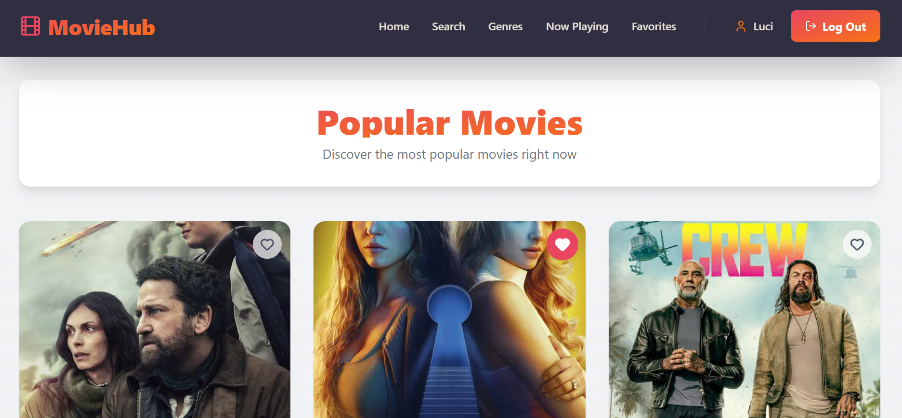
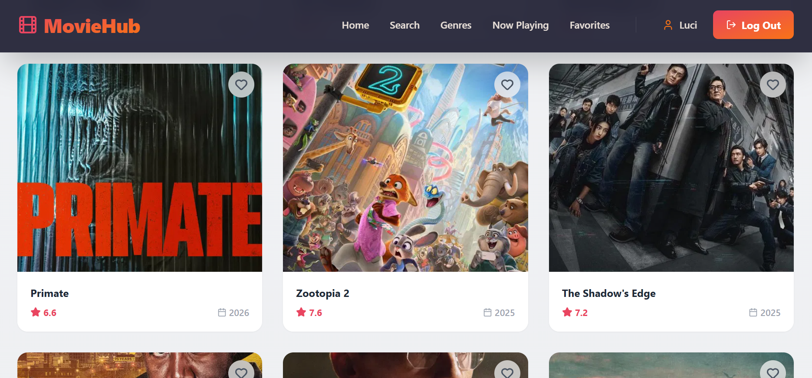
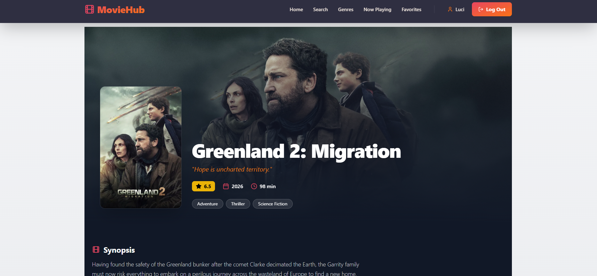
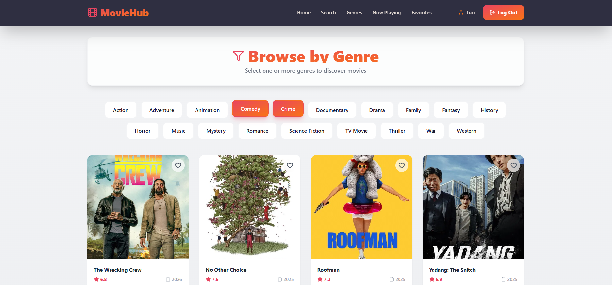
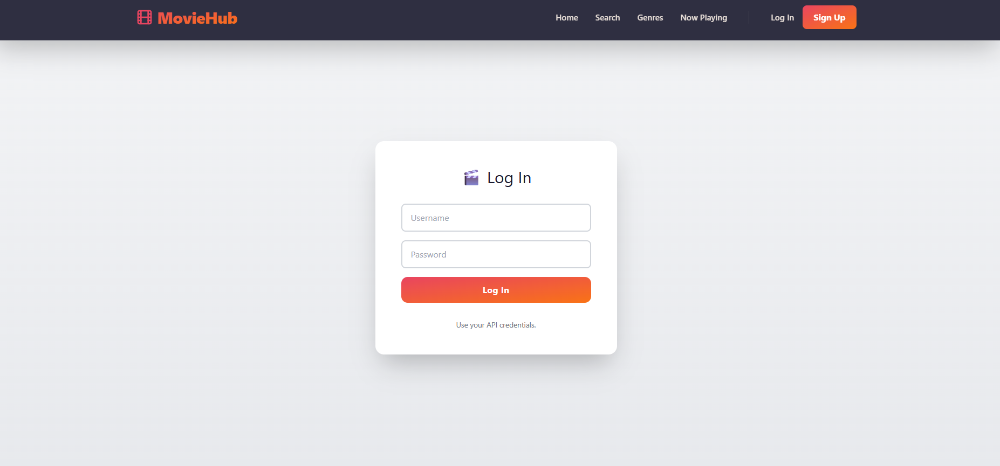

# 🎬 MovieHub - Movie Explorer App


A modern web application to explore movies using **The Movie Database (TMDB)** API. Developed with React, TypeScript, and Vite, featuring a robust architecture and declarative routing.

## 📋 Table of Contents
- [🎯 Objectives](#-objectives)
- [✨ Features](#-features)
- [📸 Screenshots](#-screenshots)
- [📖 Usage Guide](#-usage-guide)
- [📁 Project Structure](#-project-structure)
- [🔍 Component Analysis](#-component-analysis)
- [🚀 Installation & Setup](#-installation--setup)
- [🎨 Technologies Used](#-technologies-used)
- [📝 Developer Notes](#-developer-notes)

---
## 🎯 Objectives
- Build a full-featured React application using **TypeScript**.
- Implement **Atomic Design** for a scalable component architecture.
- Master **Declarative Routing** and Route Guards.
- Integrate third-party APIs (TMDB) and external authentication services.

## ✨ Features

- 🔐 **Secure Authentication** via external API (JWT/Token based).
- 🎥 **Discover Movies**: Browse popular and now playing titles.
- 🔍 **Smart Search**: Real-time search functionality by title.
- 🎭 **Genre Filtering**: Explore movies by specific categories.
- 📱 **Responsive Design**: Fully adapted for mobile and desktop using Tailwind CSS.
- 🛡️ **Protected Routes**: Secure access control for authenticated users.
- ⚡ **Declarative Mode**: Clean and readable React Router implementation.

---
## 📸 Screenshots

Below are the visual highlights of **MovieHub**. The interface is designed to provide an immersive and fluid cinematic experience.

### 🏠 Home & Discovery
Browse the most popular movies right now. The interface features a clean grid layout with modern hover effects and real-time data from the TMDB API.



### 🧩 Browse & Selection
Users can navigate through various categories and view movie ratings and release years at a glance. The design focuses on high-quality posters and clear typography.

<p align="center">
  
</p>

### 🎬 Movie Details (Protected View)
A deep dive into movie information, featuring dynamic hero sections with backdrop images, full synopses, and detailed cast information.



### 🔍 Smart Search & Genre Filtering
Find exactly what you are looking for using our real-time search bar or browse specific movie categories through the intuitive genre filter.

<p align="center">
  
  
</p>

### 🔐 Secure Authentication
A clean and user-friendly login interface that protects sensitive routes and allows users to manage their personal movie collections.

<p align="center">
  
</p>

---

## 📖 Usage Guide
1. **Explore**: Browse the home page to see popular movies.
2. **Search**: Use the search bar to find specific titles with real-time feedback.
3. **Filter**: Go to the Genres page to narrow down movies by categories.
4. **Favorites**: Log in to save your favorite movies to your personal list.
5. **Details**: Click on any movie card to see full information, cast, and crew.

---

## 📁 Project Structure

This project follows the **Atomic Design** principles for component organization.

```bash
src/
├── atoms/              # Basic reusable components (smallest units)
│   ├── Button.tsx
│   ├── Input.tsx
│   └── Loader.tsx
├── molecules/          # Compound components
│   ├── MovieCard.tsx
│   └── SearchBar.tsx
├── organisms/          # Complex sections
│   └── MovieGrid.tsx
├── layout/             # Application shell
│   ├── MainLayout.tsx
│   └── Navbar.tsx
├── routes/             # Page views
│   ├── Home.tsx
│   ├── Search.tsx
│   ├── Genres.tsx
│   ├── NowPlaying.tsx
│   ├── MovieDetail.tsx
│   ├── Login.tsx
│   ├── Register.tsx
│   └── NotFound.tsx
├── context/            # Global state management
│   └── AuthContext.tsx
├── hooks/              # Custom Logic
│   ├── useAuth.ts
│   └── useMovies.ts
├── services/           # API Integration
│   ├── auth.service.ts
│   └── movie.service.ts
├── guards/             # Route Protection
│   └── PrivateRoute.tsx
├── types/              # TypeScript Definitions
│   └── movie.types.ts
├── App.tsx             # Main Router Configuration
└── main.tsx            # Entry Point

````
## 🔍 Component Analysis

### 📦 Atoms (Basic UI)
- **Button.tsx**: Reusable button component with variant support (primary/secondary) and hover animations.
- **Input.tsx**: Standardized text input field with focus states and transitions.
- **Loader.tsx**: Visual loading indicator (spinner) used during async data fetching.

### 🧩 Molecules (Compound UI)
- **MovieCard.tsx**: Displays individual movie information (poster, title, rating). Handles navigation to the detail view on click.
- **SearchBar.tsx**: Search form containing an input and a submit button. Emits search terms to the parent component.

### 🏗️ Organisms (Complex UI)
- **MovieGrid.tsx**: A responsive grid layout that renders a list of MovieCard components. Handles empty states automatically.

### 🎨 Layout
- **MainLayout.tsx**: The base wrapper for the application. Contains the Navbar, the main content area (Outlet), and the footer.
- **Navbar.tsx**: Responsive navigation bar. Adapts content based on auth state (shows Login/Register or User Profile/Logout).

### 📄 Routes (Pages)
- **Home.tsx**: Landing page displaying popular movies with pagination.
- **Search.tsx**: Dedicated search page with debounce functionality (500ms) to filter movies.
- **Genres.tsx**: Allows users to filter movies by specific genres (Action, Drama, etc.).
- **NowPlaying.tsx**: Showcase of movies currently in theaters.
- **MovieDetail.tsx** (Protected): Full view of a movie's metadata, including backdrop, budget, revenue, and duration.
- **Login.tsx & Register.tsx**: Authentication forms with validation and error handling.
- **NotFound.tsx**: Custom 404 error page.

### 🌐 Context & State
- **AuthContext.tsx**: Manages the global user session. Persists authentication state via localStorage.

### 🪝 Custom Hooks
- **useAuth.ts**: Encapsulates authentication logic (login, register, logout) and exposes the current user state.
- **useMovies.ts**: Abstraction layer for fetching movie data. Handles loading states and errors for lists and details.

### ⚙️ Services (API)
- **auth.service.ts**: Handles HTTP requests to the Auth API (`http://www.ies-azarquiel.es/paco/apigafas`).
- **movie.service.ts**: Interface for the TMDB API (`https://api.themoviedb.org/3`). Handles endpoints for popular, search, details, and images.

### 🛡️ Guards
- **PrivateRoute.tsx**: A High-Order Component (wrapper) that checks if a user is authenticated. If not, it redirects to `/login`.

----

## 🚀 Installation & Setup

### Prerequisites
- Node.js 18+
- npm or yarn

### 1. Clone and Install
```bash
git clone <repository-url>
cd movie-gallery
npm install
````
### 2. Environment Variables
Create a `.env` file in the root directory:

```env
VITE_API_KEY=your_tmdb_api_key
VITE_API_URL=[https://api.themoviedb.org/3](https://api.themoviedb.org/3)
````

### 3. Run Development Server
```bash
npm run dev
````
Access the app at [http://localhost:5173](http://localhost:5173)

---

## 🎨 Technologies Used
- **React 18**: UI Library.
- **TypeScript**: For static typing and code reliability.
- **Vite**: Next-generation frontend tooling.
- **React Router v6**: Declarative routing system.
- **Tailwind CSS**: Utility-first CSS framework.
- **Axios / Fetch**: HTTP Client.

## 📝 Developer Notes
This project strictly adheres to the **Declarative Routing** pattern of React Router v6:

- Routes are defined as JSX components (`<Route>`).
- Layouts use the `Outlet` component.
- Guards encapsulate protected components directly in the JSX tree.

---
*Developed for DWEC - Final React Project*

